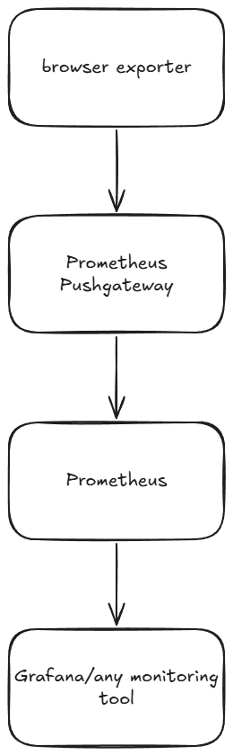

# browser-exporter

Export statistics from your browser to prometheus via pushgateway.

## Avalible Metrics

- browser_bookmarks
- browser_bookmarks_created
- browser_memory_available_bytes
- browser_existing_bytes
- browser_tab_zoom_factor
- browser_tabs_active
- browser_tabs_blank
- browser_tabs_changed
- browser_tabs_closed
- browser_tabs_currentactive
- browser_tabs_discarded
- browser_tabs_muted
- browser_tabs_open
- browser_tabs_opened
- browser_webrequests_completed_total
- browser_webrequests_error_total
- browser_windows_open
- browser_windows_closed
- browser_windows_opened

all metrics are labeled with a UUID generated by the extension.

## Architecture



browser exporter pushes to prometheus pushgateway, that is then scraped by
prometheus.

not shown, but a reverse proxy is **REQUIRED** between pushgatway and browser
exporter, as chrome's `manifest.json` only allows https traffic.

## Self-Hosting

The extension really just needs a pushgateway to send information to, but here is the docker compose that I use in production for the public instance.

```yml 
services:
  prometheus:
    image: prom/prometheus
    command:
      - '--config.file=/etc/prometheus/prometheus.yml'
      - '--storage.tsdb.path=/prometheus'
      - '--storage.tsdb.retention.time=90d'
    volumes:
      - "${PWD}/prometheus.yml:/etc/prometheus/prometheus.yml"
      - "${PWD}/data:/prometheus"
    ports:
      - "9090:9090"
  pushgateway:
    image: prom/pushgateway
    container_name: pushgateway
    restart: unless-stopped
    ports:
      - "9091:9091"
  proxy_server:
    image: nginx
    ports:
      - "9092:80"
    volumes:
      - "${PWD}/nginx.conf:/etc/nginx/conf.d/default.conf"
```

A reverse proxy is required, due to `known_hosts` being set to a https scheme.
**Preflight CORS** is  handled by nginx, with the following config
(along with some basic hardening)

```nginx
server {
    listen 80;
    server_name proxy_server;
    # Allow POST requests to /metrics/job/* and handle CORS preflight
    location ~ ^/metrics/job/.*$ {
        # Handle CORS Preflight (OPTIONS)
        if ($request_method = 'OPTIONS') {
            add_header 'Access-Control-Allow-Origin' '*' always;
            add_header 'Access-Control-Allow-Methods' 'POST, OPTIONS' always;
            add_header 'Access-Control-Allow-Headers' 'DNT,User-Agent,X-Requested-With,If-Modified-Since,Cache-Control,Content-Type,Range' always;
            add_header 'Access-Control-Max-Age' 1728000 always;
            add_header 'Content-Type' 'text/plain; charset=utf-8' always;
            add_header 'Content-Length' 0 always;
            return 204;
        }

        # Handle POST requests
        if ($request_method != 'POST') {
            return 405; # Method Not Allowed for anything other than POST
        }

        add_header 'Access-Control-Allow-Origin' '*' always;
        add_header 'Access-Control-Allow-Methods' 'POST, OPTIONS' always;
        add_header 'Access-Control-Allow-Headers' 'DNT,User-Agent,X-Requested-With,If-Modified-Since,Cache-Control,Content-Type,Range' always;
        add_header 'Access-Control-Expose-Headers' 'Content-Length,Content-Range' always;

        # Pass POST requests to the pushgateway backend
        proxy_pass http://pushgateway:9091;
    }

    location / {
        return 200 "nice try";
    }

   access_log /var/log/nginx/access.log;
   error_log /var/log/nginx/error.log;
}
```
prometheus.yml is just 

```yml
global:
  scrape_interval: 15s

scrape_configs:
  - job_name: "pushgateway"
    honor_labels: true
    static_configs:
    - targets: [ 'pushgateway:9091' ]
```


## Development

for building chrome extensions, vite and [crxjs](https://crxjs.dev/vite-plugin/) are used.

```bash
# install dependencies
npm i

# start development server
npm run dev 

# build to /dist
npm run build
```

To add extension to browser, go to `chrome://extensions` and enable developer,
then `Load Unpacked extension`, navigate to `dist`, then load.
